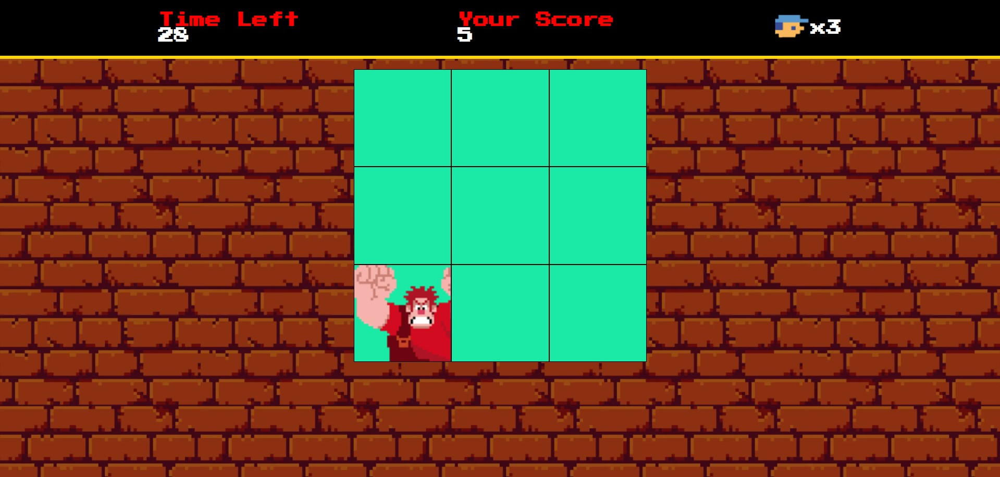

# Desafio DIO | Game Detona Ralph

Esse projeto consiste em um jogo onde o objetivo é acertar o Ralph nos quadrados onde ele aparece.

## 📝 Descrição
Projeto desenvolvido no bootcamp Ri-Happy - Front-end do zero, com o Professor Felipe Aguiar da DIO.
O obejtivo do jogo é acertar o Ralph no quadrado no qual ele aparecerá, clicando no mesmo.

## 🛠 Tecnologias utilizadas

                                                                           

## 📸 Screenshot

## 📌 Créditos

Todas as imagens e sons foram disponibilizados no repositório da DIO, e o código foi desenvolvido com base nas aulas do bootcamp Ri-Happy - Front-End do Zero com o auxílio do Professor Felipe Aguiar.
